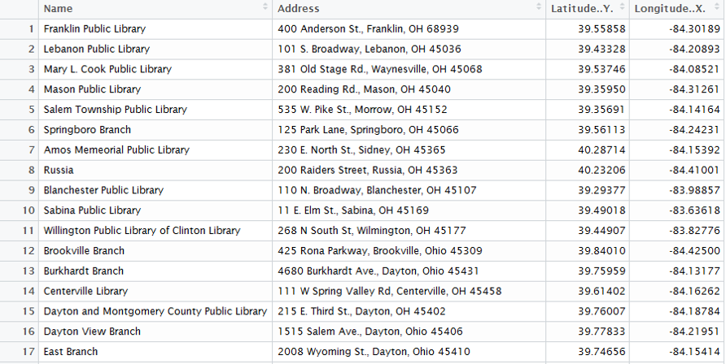
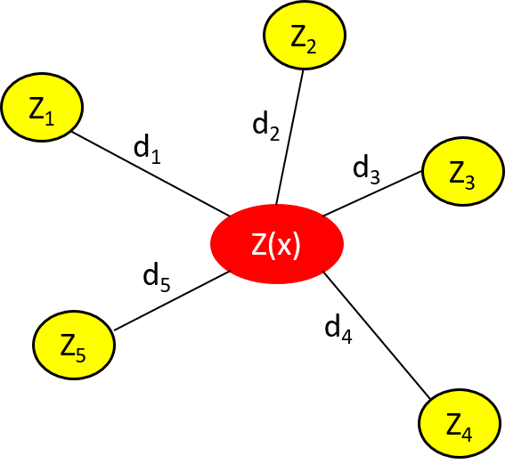

```{r setup, include=FALSE}
knitr::opts_chunk$set(echo = FALSE)
library(publicLibs)
library(shiny)
```

# Overview

- Background
    - Public-Private Partnerships
    - Public-Public Partnerships
- Research Statement and Questions
- Methodology
    - Data Summary
    - Analysis
- Interactive Plot


# Background

- AF maintains 20% surplus infrastructure capacity^1^
- 2014 only 65% of the FSRM requirement was funded^2^
- Strategic Basing proposed to eliminate funding issues^2^
- Air Force P4 Initiative:

> “The Air Force Community Partnership Program is a framework through which installation and public/private sector community       leaders can develop innovative ways to leverage their capabilities and resources to obtain shared value and benefit by           avoiding or reducing costs.”

 

# Background

## Public-Private Partnerships

- An arrangement between public and private entities to work together^4^
- U.S. Definition: 
    - A contractual arrangement between a public agent and a for-profit private actor
    - Resources and risks are shared to deliver a public service or public infrastructure^5^
- Partnerships bring together strong qualities from each sector
- High complexity for infrastructure procurement

# Background

## Public-Public Partnerships

- Collaboration between two or more public authorities^6^
- Used in water service reform in developing countries due to failed private sector involvement
    - Sweden and Latvia
    - Sweden and Lithuania
- Not-for-profit key for effective interaction
- "Unlikely that a PPP could have achieved the same developmental objectives..."^6^


# Reseach Statement

> This research effort investigated the off-base community of an installation to predict where partnerships are more likely to succeed.  For each CONUS installation, the library service provided by the community was analyzed to produce an index using inverse distance weighting. The index takes into account the quality of each instance of the service and the distance from the installation.  These indices were then compared and used as a predictor for where a library partnership could be used.

## Reseach Questions:

- Which CONUS installations have off-base communities capable of providing base library service through P4 opportunities?

- Can community demographics (population, occupation/industry size, etc.) be used to predict the same rank order to determine P4 opportunities?


# Methodology

## Data Summary

<div class = 'columns-2'>
- Sources of data: <a target=' ' href='http://www.publiclibraries.org'>www.publiclibraries.org</a> and <a target=' ' href='http://www.public-libraries.com'>www.public-libraries.com</a>
- Data converted from HTML tables to data-frame in R
- Libraries geocoded using Google-maps Application Programming Interface


<br>

<center>  </center>
\hfill


<center>  </center>

</div>

# Methodology

<br>

```{r, echo=FALSE, warning=FALSE, message=FALSE}

shinyApp(options = list(width = '100%', height = '800px'),

ui = fluidPage(mainPanel(DT::dataTableOutput("states", height = "800px"),
                         width = 12)),

server = function(input, output, session){

  library(DT)
  output$states <- DT::renderDataTable({
                   DT::datatable(publicLibs::US_Libs[1:2000,],                                                     options = list(pageLength = 14))
})
})

```


# Methodology

## Analysis

- Inverse-Distance-Weighted (IDW) Average
    - Tobler’s First Law: “All things are related, but nearby things are more related than distant things”^7^
    - Library index estimates the value of the libraries surrounding the installation
    - Uses known values to estimate value at nearby points^8^
- $z(x) = \frac{\sum_{i=1}^{n}W_i * Z_i}{\sum_{i=1}^{n}W_i}$

    - $W_i = 1/d_i^2$

    - $Z_i =$ Size of the library    

<!-- <div class='columns-2'> -->


<!-- <br> -->

  
 


<!-- </div> -->


# Interactive Plot

```{r eval=FALSE}
teachingApps:::offbase_libraries()
```

# Summary

- Background
    - Public-Private Partnerships
    - Public-Public Partnerships
- Research Statement and Questions
- Methodology
    - Data Summary
    - Analysis
- Interactive Plot


# References

<style type='text/css'>
ol li {font-size:18pt;}
</style>

1.  GAO. (2013). GAO Defense Infrastructure. Washington DC: United States Government Accountability Office.
2.  Johnson, B., & Clark, L. (2015, September). A Plan for Strategic Basing. The Military Engineer, 52 – 54.
3.  Team, A. F. C. P. (2015). AF Community Partnership Program signs 100th partnering agreement. Retrieved February 21, 2016, from <http://www.af.mil/News/ArticleDisplay/tabid/223/Article/608603/af-community-partnership-program-signs-100th-partnering-agreement.aspx>
4.  Hodge, G. a., & Greve, C. (2007). Public Private Partnerships: An International Performance Review. Public Administration Review, 67(3), 545–558. <http://doi.org/10.1111/j.1540-6210.2007.00736.x>
5.  Li, B., & Akintoye, A. (2003). An Overview of Public-Private Parnership. In A. Akintoye, M. Beck, & C. Hardcastle (Eds.), Public-Private Partnerships: Managing Risks and Oppurtunities. John Wiley & Sons. Retrieved from <https://books.google.com/books?hl=en&lr=&id=Y_hAmDKmJM0C&pgis=1>
6.  Lobina, E., & Hall, D. (2006). Public-Public Partnerships as a catalyst for capacity building and institutional development: Lessons from Stockholm Vatten’s experience in the Baltic region. Retrieved from <http://www.psiru.org/reports/2006-09-W-PUPs.doc>
<!-- 7.  Lang, D. T., & the CRAN Team. (2016). XML: Tools for Parsing and Generating XML Within R and S-Plus. Retrieved from <https://cran.r-project.org/package=XML> -->
<!-- 8.  Kahle, D., & Wickham, H. (2013). ggmap: Spatial Visualization with ggplot2. The R Journal, 5(1), 144–161. Retrieved from <http://journal.r-project.org/archive/2013-1/kahle-wickham.pdf> -->
7.  De Smith, M., Goodchild, M. F., & Longley, P. a. (2015). Geospatial Analysis 5th Edition, 2015. Retrieved from <http://www.spatialanalysisonline.com/HTML/index.html>
8.  Longley, P., & Goodchild, M. (2011). Geographic Information Systems and Science (Third). John Wiley & Sons. Retrieved from <https://books.google.com/books?hl=en&lr=&id=toobg6OwFPEC&pgis=1>

# Tips for AFIt
- Find a thesis advisor that you can work with, or a topic that you are really interested in
- Take COMM 680 (write first three chapters)
- Start using Mendeley or other citation manager for class papers
- Get an external hard drive network approved
- STAT 535 will teach you JMP, try and learn the same functions in R
- STRONG Lab training and nutritional studies offered (Bldg. 840, Rm W205)


