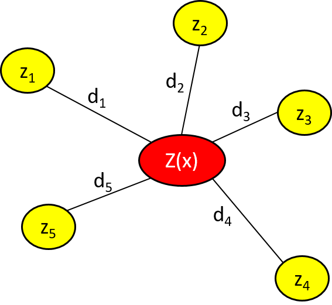

```{r setup, include=FALSE}
knitr::opts_chunk$set(echo = FALSE)
library(publicLibs)
library(shiny)
```

# Overview

- Background
    - Public-Private Partnerships
    - Public-Public Partnerships
    - Outsourcing Drivers
- Problem Statement
- Research Statement
- Methodology
    - Data Summary
    - Analysis
- Interactive Plot


# Background

## Partnerships

- Public agencies may not have resources to build and maintain infrastructure
- Private sector is more specialized
- City of Long Beach^1^
    - Demolish and build: city hall, library, park and port headquarters
    - Investment capital allocated to private sector
- Can be used to meet a variety of needs
    - Private-Public Partnerships
    - Public-Public Partnerships
    
# Background

## Public-Private Partnerships

- An arrangement between public and private entities to work together^2^
- U.S. Definition: 
    - A contractual arrangement between a public agent and a for-profit private actor
    - Resources and risks are shared to deliver a public service or public infrastructure^3^
- Partnerships bring together strong qualities from each sector
- High complexity for infrastructure procurement

# Background

## Public-Public Partnerships

- Collaboration between two or more public authorities^4^
- Used in water service reform in developing countries due to failed private sector involvement
    - Sweden and Latvia
    - Sweden and Lithuania
- Not-for-profit key for effective interaction
- "Unlikely that a PPP could have achieved the same developmental objectives..."^4^

# Background

## Outsourcing Drivers

- Outsourcing Partnership: a business relationship where all parties involved cooperate with mutual trust, shared risk and outcomes that result in competitive advantage^5^

- Partnering Process Model^5^
    - Drivers are the motivators to partner
    - Facilitators are the enviornmental factors
        <!-- - Universal factors: corporate compatibility, similar mangerial philosophy and techniques, mutuality, and symmetry -->
        <!-- - Situation specific factors: exclusivity, shared competitors, geographic proximity, prior history, shared end user -->


# Problem Statement
- No guidance exists to identify partnership oppurtunities around an installation
- Air Force P4 Initiative:

> “The Air Force Community Partnership Program is a framework through which installation and public/private sector community leaders can develop innovative ways to leverage their capabilities and resources to obtain shared value and benefit by avoiding or reducing costs.”

- Strategic Basing Model^6^
    - Model proposed 7 different installation types: traditional, mission, hybrid, city-base, joint, total force association, and warm
    - Installation functions catagorized as core, important and peripheral
    - Peripheral services could be provided by the community through partnerships
  

# Reseach Statement

> This research effort investigated the off-base community to build a tool to identify installations which should explore partnership opportunities.  The scope of this research will be limited to exploring library partnership opportunities at Air Force installations located in the Continental United States (CONUS). This research investigates the facilitators, or environmental factors, to identify where greater opportunities for creating partnerships may exist.  The result of this research is a tool which produces a relative measure for each off-base community, where higher values indicate a greater potential for partnerships.  This relative measure utilizes inverse distance weighting (IDW) between an installation and each service location in the surrounding community. 

<!-- The tool utilized inverse distance weighting (IDW) to compute relative measure for each installation.  The measure takes into account the quality of each service and the distance it was located from the installation.  Comparing installations measures for a specific service allows for partnership opportunities to be identified. -->

<!-- > This research effort investigated the off-base community of an installation to predict where partnerships are more likely to succeed.  For each CONUS installation, the library service provided by the community was analyzed to produce an index using inverse distance weighting. The index takes into account the quality of each instance of the service and the distance from the installation.  These indices were then compared and used as a predictor for where a library partnership could be used. -->

## Scope

- Library service
- CONUS installations
- Primary factors: distance and size

<!-- ## Reseach Questions: -->

<!-- - Which CONUS installations have off-base communities capable of providing base library service through P4 opportunities? -->

<!-- - Can community demographics (population, occupation/industry size, etc.) be used to predict the same rank order to determine P4 opportunities? -->


# Methodology

## Data Summary

<div class = 'columns-2'>
- Sources of data: <a target=' ' href='http://www.public-libraries.org'>www.public-libraries.org</a> and <a target=' ' href='http://www.publiclibraries.com'>www.publiclibraries.com</a>
- Data converted from HTML tables to data-frame in R
- Libraries geocoded using Google-maps Application Programming Interface


<br>

<center>  </center>
\hfill


<center>  </center>

</div>

# Methodology

## Data Summary - www.public-libraries.org

 

 


# Methodology

## Data Summary - www.publiclibraries.com


 

 


# Methodology

## Library Size Estimate^7^

- Collection Space = $13*(N_b+N_v+N_a)+(45*N_i)$
    - $N_b =$ Number of books
    - $N_v =$ Number of serial volumes
    - $N_a =$ Number of audio visual materials
    - $N_i =$ Number of internet terminals
    
- Work Space = $150*N_w+30*N_s$
    - $N_w =$ Number of workstations
    - $N_s =$ Number of seats
- Gross Area = (Collection Space + Work Space)$*117%$
- Library Size = Gross Area $*127%$


# Methodology

## Data Summary

<br>

```{r, echo=FALSE, eval=TRUE}
DT::datatable(publicLibs::US_Libs[1:2000,])
```


# Methodology

## Analysis

- Inverse-Distance-Weighted (IDW) Average
    - Tobler’s First Law: “All things are related, but nearby things are more related than distant things”^8^
    - Library index estimates the value of the libraries surrounding the installation
    - Uses known values to estimate value at nearby points^9^
- $z(x) = \frac{\sum_{i=1}^{n}W_i * Z_i}{\sum_{i=1}^{n}W_i}$

    - $W_i = 1/d_i^2$

    - $Z_i =$ Size of the library    

<!-- <div class='columns-2'> -->


<!-- <br> -->

  
 


<!-- </div> -->


# Interactive Plot

```{r out.width='100%'}
knitr::include_app('https://afit.shinyapps.io/offbase_libraries', height = '800px')
```

# Summary

- Background
    - Public-Private Partnerships
    - Public-Public Partnerships
    - Outsourcing Drivers
- Problem Statement
- Research Statement
- Methodology
    - Data Summary
    - Analysis
- Interactive Plot


# References

<style type='text/css'>
ol li {font-size:18pt;}
</style>

1.  Merewitz, S. (2016). Innovative Public-Private Partnership for the New Long Beach Civic Center. Retrieved February 18, 2016, from http://www.publicceo.com/2016/02/innovative-public-private-partnership-for-the-new-long-beach-civic-center/
2.  Hodge, G. a., & Greve, C. (2007). Public Private Partnerships: An International Performance Review. Public Administration Review, 67(3), 545–558. <http://doi.org/10.1111/j.1540-6210.2007.00736.x>
3.  Li, B., & Akintoye, A. (2003). An Overview of Public-Private Parnership. In A. Akintoye, M. Beck, & C. Hardcastle (Eds.), Public-Private Partnerships: Managing Risks and Oppurtunities. John Wiley & Sons. Retrieved from <https://books.google.com/books?hl=en&lr=&id=Y_hAmDKmJM0C&pgis=1>
4.  Lobina, E., & Hall, D. (2006). Public-Public Partnerships as a catalyst for capacity building and institutional development: Lessons from Stockholm Vatten’s experience in the Baltic region. Retrieved from <http://www.psiru.org/reports/2006-09-W-PUPs.doc>
5.  Lambert, D. M., Emmelhainz, M. A., & Gardner, J. (1996). So You Think You Want a Partner? Marketing Management, 5(2), 25–41.
6.  Johnson, B., & Clark, L. (2015, September). A Plan for Strategic Basing. The Military Engineer, 52 – 54.
7.  Dahlgren, A. C. (2009). Public Library Space Needs: A Planning Outline. Madison, Wisconsin.
8.  De Smith, M., Goodchild, M. F., & Longley, P. a. (2015). Geospatial Analysis 5th Edition, 2015. Retrieved from <http://www.spatialanalysisonline.com/HTML/index.html>
9.  Longley, P., & Goodchild, M. (2011). Geographic Information Systems and Science (Third). John Wiley & Sons. Retrieved from <https://books.google.com/books?hl=en&lr=&id=toobg6OwFPEC&pgis=1>


<!-- 7.  Lang, D. T., & the CRAN Team. (2016). XML: Tools for Parsing and Generating XML Within R and S-Plus. Retrieved from <https://cran.r-project.org/package=XML> -->
<!-- 8.  Kahle, D., & Wickham, H. (2013). ggmap: Spatial Visualization with ggplot2. The R Journal, 5(1), 144–161. Retrieved from <http://journal.r-project.org/archive/2013-1/kahle-wickham.pdf> -->


<!-- # Extra -->

<!-- - AF maintains 20% surplus infrastructure capacity^1^ -->
<!-- - 2014 only 65% of the FSRM requirement was funded^2^ -->
<!-- - Strategic Basing proposed to eliminate funding issues^2^ -->

```{r, echo=FALSE, warning=FALSE, message=FALSE, eval=FALSE}

shinyApp(options = list(width = '100%', height = '800px'),

ui = fluidPage(mainPanel(DT::dataTableOutput("states", height = "800px"),
                         width = 12)),

server = function(input, output, session){

  library(DT)
  output$states <- DT::renderDataTable({
                   DT::datatable(publicLibs::US_Libs[1:2000,],                                                     options = list(pageLength = 14))
})
})

```


